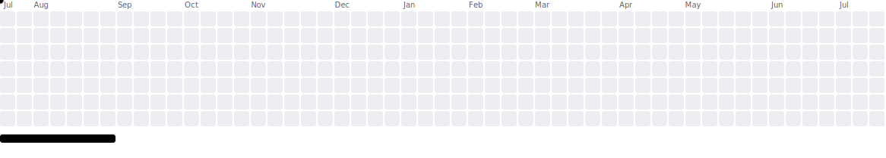

<h2 align="left">Hi 👋! My name is Srinivas and I'm a Data Scientist & AI Engineer from India</h2>

  Building end-to-end ML pipelines, RAG systems, and agentic AI workflows.
  Currently at <strong>Evoke Technologies</strong> · Previously AI Engineer @ Turing · Systems Engineer (AI/ML) @ Infosys

  I design training datasets for client AI models, SFT, RLMF, and RL trajectories and evaluate agents across
  <strong>Terminal-Bench</strong>, <strong>SWE-bench</strong>, <strong>OSWorld</strong>, and similar RL environments
  for providers including <strong>OpenAI</strong>, <strong>Claude</strong>, <strong>Tencent</strong>, and <strong>Alibaba</strong>.

###

  
  

###

###

<h3 align="left">🛠️ Tech Stack</h3>

<strong>Core ML & Data</strong>

  
  
  
  
  
  
  
  
  
  
  
  
  
  
  

 

<strong>LLMs, Fine-Tuning & RAG</strong>

  
  
  
  
  
  
  
  
  
  
  
  
  
  

 

<strong>RL Environments & Agent Benchmarks</strong>

  
  
  
  
  
  
  
  
  

 

<strong>Cloud, MLOps & Platforms</strong>

  
  
  
  
  
  
  
  
  
  
  
  
  
  
  
  
  
  

###

<h3 align="left">🧠 Skills</h3>

<strong>Generative AI & Documentation</strong>

  
  
  
  
  
  
  
  

 

<strong>Dataset Engineering & Model Training</strong>

  
  
  
  
  
  
  

 

<strong>Engineering & Analytics</strong>

  
  
  
  
  
  
  
  
  
  
  
  
  
  
  

###

  
  
  

###

<h3 align="left">🎮 Contribution Graph Games</h3>

My GitHub activity, animated as classic arcade games, updated daily via GitHub Actions.

#### 🐍 Snake

<picture>
  <source media="(prefers-color-scheme: dark)" srcset="./dist/snake-dark.svg">
  <source media="(prefers-color-scheme: light)" srcset="./dist/snake.svg">
  
</picture>

#### 👻 Pac-Man

<picture>
  <source media="(prefers-color-scheme: dark)" srcset="./dist/pacman-contribution-graph-dark.svg">
  <source media="(prefers-color-scheme: light)" srcset="./dist/pacman-contribution-graph.svg">
  
</picture>

#### 🧱 Breakout

<picture>
  <source media="(prefers-color-scheme: dark)" srcset="./dist/breakout-contribution-graph-dark.svg">
  <source media="(prefers-color-scheme: light)" srcset="./dist/breakout-contribution-graph.svg">
  
</picture>

#### 🚀 Galaga

<picture>
  <source media="(prefers-color-scheme: dark)" srcset="./dist/galaga-contribution-graph-dark.svg">
  <source media="(prefers-color-scheme: light)" srcset="./dist/galaga-contribution-graph.svg">
  
</picture>

###
